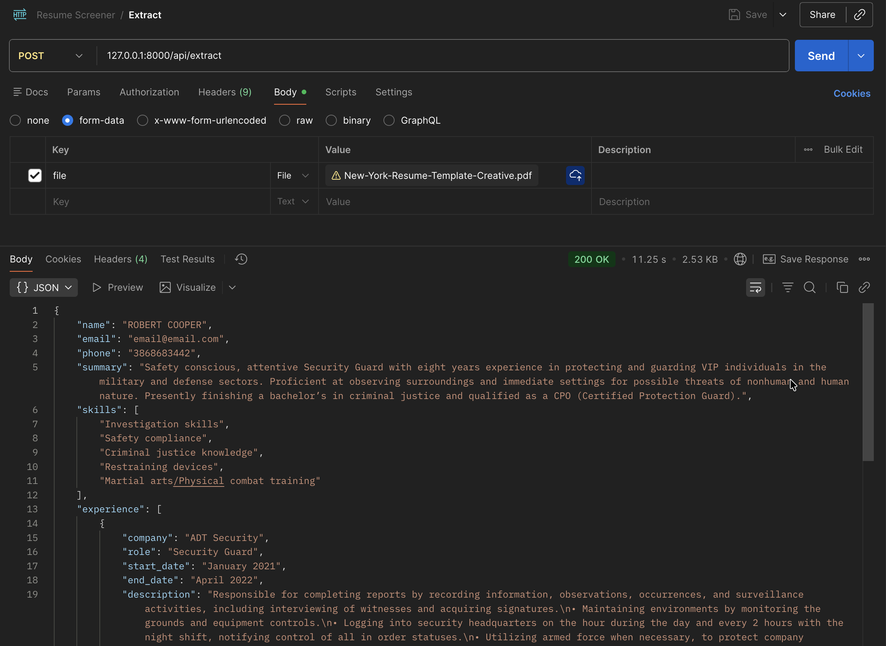

# resume-screener
Simple resume text extractor and parser using PyMuPdf, Gemini Models. Additional search functionality using PostgreSQL and Qdrant.

How to run:
1. Install dependencies:
```bash
python3 -m pip install -r requirements.txt
```

2. Set up environment variables for Gemini API key and model ID.
```bash
export GEMINI_API_KEY="your_api_key_here"
export GEMINI_MODEL_ID="your_model_id_here"
```
Fetch model id from [here](https://developers.generativeai.google/products/gemini/models) and you can get API key from Google AI Studio for free.

3. Start the FastAPI server: `uvicorn app:app --reload`

4. Example - 

Below is a screenshot from the POSTMAN application testing the API on localhost.

